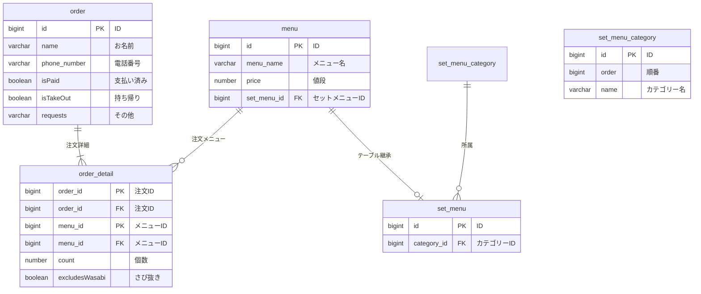

# 課題1

# 課題1-1

- 前提
    - 顧客情報はいったん管理しない想定
        - 手書きの紙運用であることを考えると、customerテーブルを持つと顧客紐づけが難しいと判断
    - ミュータブルデータベースを設計
        - イミュータブルにするほど、過去の事実が重要視されるアプリではないと判断
    - 地元に生まれた味の化粧箱入りは、化粧箱入りでないものと別レコードに格納される
    - 合計皿数は、order_detailから導出する
        - 性能面で問題が出るなら、orderテーブルにカラムとして生やすのもあり
- 工夫ポイント
    - セットメニューとそれ以外のメニューを区別するため、テーブル継承を利用

## やるべきだと思いつつ、未対応ポイント

DDLやDMLを作ってしまった後に気づいたため、未対応

- 注文が提供済みなのかをフラグ管理していない
    - 未対応/対応中/対応済み/キャンセル済みのような形で、
    status管理したほうが良い気がする
- 注文日をデータベースに格納していない
    - 月単位での売り上げ管理や、時間帯単位での売り上げ管理などの要件が出てくる場合必要になる
- order or order_detailに売り上げを持たせる
    - 商品の単価が変わったときに対応できない
    - 小計が重要なのか、合計が重要なのかによってどこに持たせるかが変わる
        - 小計: 当時の単価を計算するために＆特定の期間限定セールに対応するため
        - 合計: 税率計算時に端数を出さないため
- 商品単価の変更に対する対応方法を検討する
    - menuに履歴を含め複数レコードを用意するのが妥当だと思われる
        - 商品単価の管理は商品を管理するテーブルに事実として残しておくべき
    - おそらくmenu_price_detailテーブルを用意する必要がある
        - 価格が変更された場合、別のレコードを作成する
        - menuを複数レコードにすると、1商品が複数レコードに分散するのでよくないと判断

# 課題1-2

参考ページ

[https://zenn.dev/umi_mori/books/331c0c9ef9e5f0/viewer/110b8e](https://zenn.dev/umi_mori/books/331c0c9ef9e5f0/viewer/110b8e)

## 論理モデル

- 論理モデルは、ビジネス要件に基づいてデータの構造を定義する抽象的なモデルです。
    - どのようなテーブルを作成し、各テーブルにどのような列を設けるべきかを簡単にまとめる
- DBMS（データベース管理システム）や物理的な実装に依存せず、データの意味と関係性を表現します。
- 実際のデータベースに依存せず、ビジネスルールや要件を反映。
- データ（エンティティ）、属性、リレーションシップを定義。
- 多対多の分解、主キー/外部キーの認識、正規化までを行う

## 物理モデル

- 物理モデルは、論理モデルを基に、特定のDBMS（例: MySQL, PostgreSQL, Oracleなど）で実際にデータベースを実装するための設計です。
- ストレージ構造やパフォーマンス要件を具体化します。
- 特定のDBMSやハードウェア環境を考慮
- 属性ごとにDBMSのデータ型（例: `VARCHAR`, `INTEGER`, `DATE`など）を指定。
- パフォーマンス向上のためのインデックス作成・パーティショニングを実施。
- NOT NULL、UNIQUE、FOREIGN KEY などの制約を明確化。