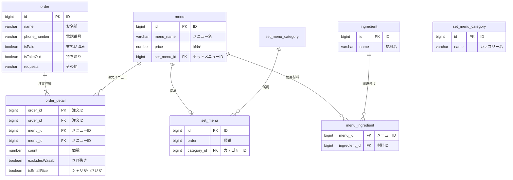

# 課題2

# 課題2-1

- order_detailテーブルにisSmallRiceフラグを立てる
    - 3値以上をとる場合には対応するカテゴリーIDなどを格納したほうが良い

# 課題2-2

- メニューに含まれる寿司ネタを管理する
    - 原材料テーブルを新規に作成し、それをメニューに紐づける

# 課題2-3

- 期間限定フェア等が行われることで、メニューの単価が変動する

