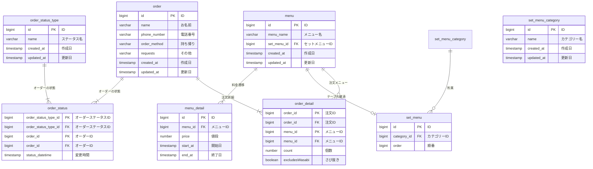

# 感想

- テーブル継承を使ってみたがどの程度有効か少し不安
  - ここまでやる必要があるかは講師陣のフィードバックが欲しい
- DBeaver などの名前だけ知っているツールを使ってみたが、使いこなすのは難しそう
  - ほかの課題も実行する中で、ツールにも順応していきたい

# 他の人のレビューを行ったうえでの学び・ER 図修正

- 削除済み/支払い済み/キャンセル済み等をで持たせようとしていたが、日付で持たせるのはいいかもしれない
  - ただ、nullable のフィールドが増えるのがどうなのかは要件等
    - 以下のようなテーブルを作成することにより、拡張性が高まるとのこと。確かに高まりそうだが、そこまでやるかは諸説？
    - https://qiita.com/z_k_yama/items/6927561d4ca8b0752efe
- イミュータブルデータベースのように、menu_history のようなテーブルを作成したほうがよさそう
  - 論理削除のようなカラムを削除できるので、好ましい。
  - 過去の履歴を追いやすい＆インデックスを張りやすいのも特徴
- created_at・updated_at をリソース系のテーブルに持ったほうがよさそう
  - イベント系のテーブルについては諸説。中間テーブルに持つかも諸説。
- 商品に対するセール・合計に対するセールの双方を想定すると、price は小計と合計の双方に持つべき
- boolean のフィールドは enum 化を検討してもよさそう
  - 現状は 2 値しかないが将来的に 3 値以上に増える可能性もあるため
- orderを持たせるテーブルをset_menuに移動した
  - set_menu_categoryはカテゴリーの定義であり、set_menu内の順番を持たせるのは不適切と考えたため

# 修正した ER 図

# 要調査

- status の変化があったときに日付だけをテーブルに格納する場合と、status をテーブルに格納する場合がある。どちらがより好ましいか、どのようにどちらを使えばいいかを検討したい。
