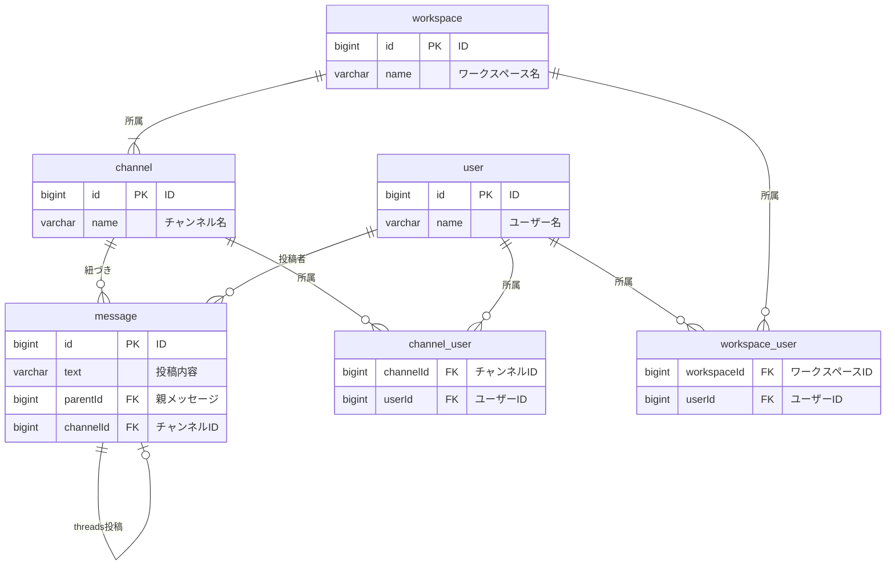

# 課題

- 前提
  - 各エンティティには最小限の値のみを保持させている



# DML/DDL/ユースケースを想定したクエリの作成

## DML

```SQL
-- ワークスペーステーブル
CREATE TABLE workspace (
    id BIGINT PRIMARY KEY,         -- ID
    name VARCHAR(255) NOT NULL     -- ワークスペース名
);

-- チャンネルテーブル
CREATE TABLE channel (
    id BIGINT PRIMARY KEY,         -- ID
    name VARCHAR(255) NOT NULL     -- チャンネル名
);

-- メッセージテーブル
CREATE TABLE message (
    id BIGINT PRIMARY KEY,         -- ID
    text VARCHAR(1000) NOT NULL,   -- 投稿内容
    parentId BIGINT,               -- 親メッセージ
    channelId BIGINT NOT NULL,     -- チャンネルID
    FOREIGN KEY (parentId) REFERENCES message(id),    -- 自己参照
    FOREIGN KEY (channelId) REFERENCES channel(id)    -- チャンネルとの関連付け
);

-- ユーザーテーブル
CREATE TABLE "user" (
    id BIGINT PRIMARY KEY,         -- ID
    name VARCHAR(255) NOT NULL     -- ユーザー名
);

-- チャンネルユーザー関連テーブル
CREATE TABLE channel_user (
    channelId BIGINT NOT NULL,     -- チャンネルID
    userId BIGINT NOT NULL,        -- ユーザーID
    PRIMARY KEY (channelId, userId),
    FOREIGN KEY (channelId) REFERENCES channel(id),  -- チャンネルとの関連付け
    FOREIGN KEY (userId) REFERENCES "user"(id)       -- ユーザーとの関連付け
);

-- ワークスペースユーザー関連テーブル
CREATE TABLE workspace_user (
    workspaceId BIGINT NOT NULL,   -- ワークスペースID
    userId BIGINT NOT NULL,        -- ユーザーID
    PRIMARY KEY (workspaceId, userId),
    FOREIGN KEY (workspaceId) REFERENCES workspace(id),  -- ワークスペースとの関連付け
    FOREIGN KEY (userId) REFERENCES "user"(id)           -- ユーザーとの関連付け
);
```

## DML

```SQL
-- 1. workspace テーブルにデータを挿入し、生成された ID を取得
WITH inserted_workspaces AS (
    INSERT INTO workspace (id, name)
    VALUES
        (1, '開発チーム'),
        (2, '営業チーム')
    RETURNING id, name
)
-- 2. channel テーブルにデータを挿入し、生成された ID を取得
, inserted_channels AS (
    INSERT INTO channel (id, name)
    VALUES
        (1, '技術共有'),
        (2, '進捗報告')
    RETURNING id, name
)
-- 3. user テーブルにデータを挿入し、生成された ID を取得
, inserted_users AS (
    INSERT INTO "user" (id, name)
    VALUES
        (1, '田中 太郎'),
        (2, '佐藤 花子')
    RETURNING id, name
)
-- 4. channel_user テーブルにデータを挿入し、生成された ID を取得
, inserted_channel_users AS (
    INSERT INTO channel_user (channelId, userId)
    VALUES
        ((SELECT id FROM inserted_channels WHERE name = '技術共有'), (SELECT id FROM inserted_users WHERE name = '田中 太郎')),
        ((SELECT id FROM inserted_channels WHERE name = '進捗報告'), (SELECT id FROM inserted_users WHERE name = '佐藤 花子'))
    RETURNING channelId, userId
)
-- 5. message テーブルにデータを挿入し、生成された ID を取得
, inserted_messages AS (
    INSERT INTO message (id, text, parentId, channelId)
    VALUES
        (1, '開発中のプロジェクトについて話し合おう', NULL, (SELECT id FROM inserted_channels WHERE name = '技術共有')),
        (2, '進捗の更新があります', NULL, (SELECT id FROM inserted_channels WHERE name = '進捗報告'))
    RETURNING id, text
)
-- 6. thread メッセージ（message テーブル内で親メッセージを持つメッセージ）を挿入
, inserted_thread_messages AS (
    INSERT INTO message (id, text, parentId, channelId)
    VALUES
        (3, 'プロジェクトの進捗報告に関する詳細', 1, (SELECT id FROM inserted_channels WHERE name = '技術共有'))
    RETURNING id, text
)
-- 最終的に全データを確認
SELECT * FROM workspace;
SELECT * FROM channel;
SELECT * FROM "user";
SELECT * FROM channel_user;
SELECT * FROM message;
```

## ユースケースを想定したクエリ

1. 特定のメッセージが含まれるスレッドを取得
2. ユーサーが所属するチャンネルで部分一致検索を実施

### 1. 特定のメッセージが含まれるスレッドを取得

スレッドを作らなかったので、再帰的な SQL を書かなければならなくなっている。

```SQL
WITH RECURSIVE message_thread AS (
    -- 最初に指定したメッセージを取得
    SELECT id, text, parentId, channelId
    FROM message
    WHERE id = :messageId  -- 指定されたメッセージID

    UNION ALL

    -- 親メッセージを再帰的に取得
    SELECT m.id, m.text, m.parentId, m.channelId
    FROM message m
    JOIN message_thread mt ON m.id = mt.parentId  -- 親メッセージを再帰的に取得

    UNION ALL

    -- 子メッセージを再帰的に取得
    SELECT m.id, m.text, m.parentId, m.channelId
    FROM message m
    JOIN message_thread mt ON m.parentId = mt.id  -- 子メッセージを再帰的に取得
)
-- 最終的に親と子のメッセージを表示
SELECT id, text, parentId, channelId
FROM message_thread
ORDER BY id;  -- 必要に応じて並び順を調整
```

### 2. ユーサーが所属するチャンネルで部分一致検索を実施

```SQL
SELECT id, text, channelId
FROM message
WHERE channelId IN (
    SELECT channelId
    FROM channel_user
    WHERE userId = :userId  -- ユーザーIDを指定
)
AND text LIKE '%' || :searchTerm || '%';  -- メッセージのテキストが部分一致するもの
```
