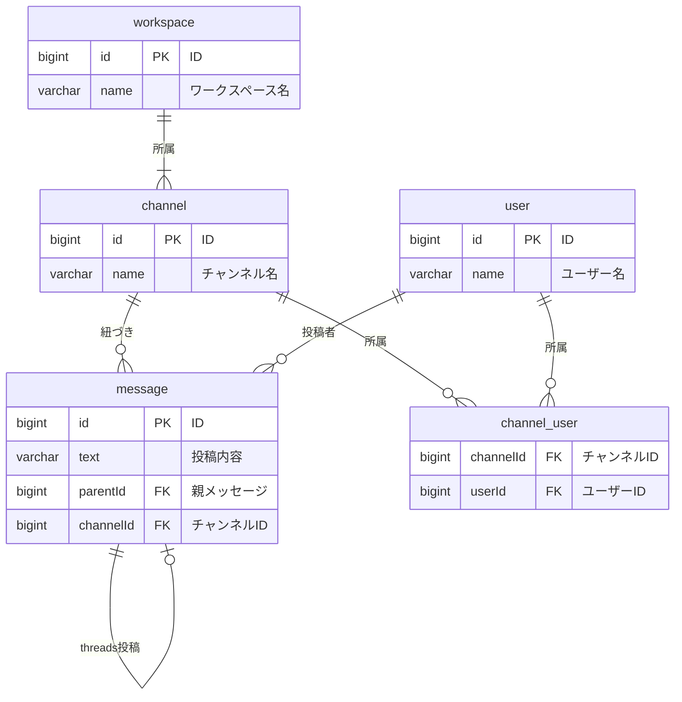

# 課題

- 前提
    - 各エンティティには最小限の値のみを保持させている

```mermaid
erDiagram
workspace ||--|{ channel  : "所属"
channel ||--o{ message : "紐づき"
message ||--o| message: "threads投稿"
user ||--o{ message : "投稿者"
channel ||--o{ channel_user : "所属"
user ||--o{ channel_user : "所属"
    
workspace {
  bigint id PK "ID"
  varchar name "ワークスペース名"
}

channel {
  bigint id PK "ID"
  varchar name "チャンネル名"
}

message {
	bigint id PK "ID"
	varchar text "投稿内容"
	bigint parentId FK "親メッセージ"
	bigint channelId FK "チャンネルID"
}

user {
	bigint id PK "ID"
	varchar name "ユーザー名"
}

channel_user {
	bigint channelId FK "チャンネルID"
	bigint userId FK "ユーザーID"
}

```

# DML/DDL/ユースケースを想定したクエリの作成

実施中