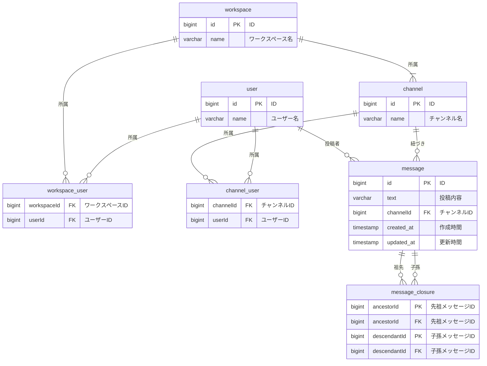

# 反省

- スレッドを作成しなかった結果、特定スレッドに所属するメッセージの全取得が困難になっている
  - スレッドを作成した場合でも SQL を考えたうえで、SQL を変更したい

# その後の調査

時間があるときに、以下の調査を行いたい。

- OSS のリポジトリより、データベース構造をのぞき見する
  - mattermost
    - docker image として mattermost を起動して、その中にある postgreSQL を覗くのが一番やりやすそう
  - ## rocket.chat
- slack の DB 構成を調べてみる ⇒ 見つからない

# アンチパターンを学習しての修正

- ナイーブツリーのアンチパターンを踏んでいる
  - 今回は、閉方テーブルを作成する形式で修正を行う
  - メッセージ取得時の順番制御は、message テーブルの created_at で制御する

