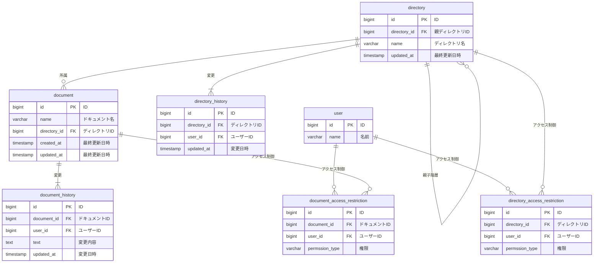
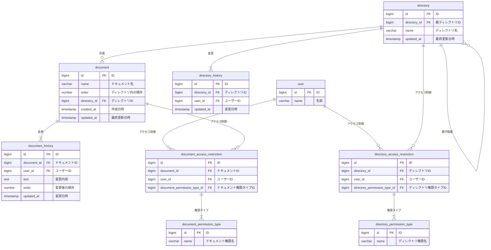

# 課題解釈

- ドキュメントに履歴テーブルのようなものを用意する
  - 最低限、ユーザー名・変更時間・変更後テキスト情報・保持する必要がありそう
    - ユーザー名をハードコードで持つかは要検討
  - 削除履歴はどのように管理するか、要検討
    - 管理しないという形にしてもいいかもしれない
  - ドキュメントとディレクトリは 1 対多の関係
  - ドキュメントから見てディレクトリは必須
  - ディレクトリの移動処理が実装しやすいかも検討する必要がありそう？
    - 紐づくドキュメントに関する変更はそこまで大変ではなさそう
  - **★ ディレクトリ異動後のアクセス権限の仕様が不明？**
    - 親ディレクトリに再帰的に閲覧権限がある場合のみアクセス可能？
    - 子ディレクトリのみにアクセス権限がある場合でもアクセス可能？
  - ディレクトリを作成したときにはドキュメントがなくてもよい？
    - 必須にしてしまうとフォルダーとファイルを同時に作る設計になってしまうので、使いづらそう
  - ディレクトリは無限にサブディレクトリを持つ
  - ディレクトリ構造は柔軟に変更可能。ディレクトリが移動してサブディレクトリになることもあり得る
    - サブディレクトリはディレクトリの一部
    - ディレクトリを移動できるという形で考えると、ディレクトリは自己参照型の ER にした方が使いやすそう
  - ユーザーは、ドキュメントごとに対してアクセス権限を設定できるのか、ディレクトリ単位でアクセス権限が設定できるのか、不明
    - 直観的にはドキュメントに対してアクセス権限が設定できる印象
  - ディレクトリを CRUD できる人を設定できる必要がある
    - 権限を横持ちにするか、縦持ちにするかは要検討
  - 管理者ロールや CRUD 権限については、特に記載がない
    - 一旦考慮しなくてよい？
    - ユーザー作成権限とかは考慮しなくてよい？
    - **★ER 図に反映することなく、追加でこの仕様が来た際にどう対応すればいいかだけ考えてみる**
  - アクセス権限のテーブルは、ディレクトリとドキュメントで同一にするか？
    - 片方のリソースのみに存在するアクセス制限等が追加されるときの柔軟性は消えるが、具体的なものが思いつかない
      - 例: ログインユーザー以外へのアクセスとか？

# ER 図



# DML

```sql
-- ユーザー テーブル
CREATE TABLE user (
    id BIGINT PRIMARY KEY,
    name VARCHAR(255) NOT NULL
);

-- ディレクトリ テーブル
CREATE TABLE directory (
    id BIGINT PRIMARY KEY,
    directory_id BIGINT,
    name VARCHAR(255) NOT NULL,
    updated_at TIMESTAMP DEFAULT CURRENT_TIMESTAMP,
    FOREIGN KEY (directory_id) REFERENCES directory(id) ON DELETE CASCADE
);

-- ドキュメント テーブル
CREATE TABLE document (
    id BIGINT PRIMARY KEY,
    name VARCHAR(255) NOT NULL,
    directory_id BIGINT,
    created_at TIMESTAMP DEFAULT CURRENT_TIMESTAMP,
    updated_at TIMESTAMP DEFAULT CURRENT_TIMESTAMP,
    FOREIGN KEY (directory_id) REFERENCES directory(id) ON DELETE CASCADE
);

-- ドキュメント履歴 テーブル
CREATE TABLE document_history (
    id BIGINT PRIMARY KEY,
    document_id BIGINT,
    user_id BIGINT,
    text TEXT,
    updated_at TIMESTAMP DEFAULT CURRENT_TIMESTAMP,
    FOREIGN KEY (document_id) REFERENCES document(id),
    FOREIGN KEY (user_id) REFERENCES user(id)
);

-- ディレクトリ履歴 テーブル
CREATE TABLE directory_history (
    id BIGINT PRIMARY KEY,
    directory_id BIGINT,
    user_id BIGINT,
    updated_at TIMESTAMP DEFAULT CURRENT_TIMESTAMP,
    FOREIGN KEY (directory_id) REFERENCES directory(id),
    FOREIGN KEY (user_id) REFERENCES user(id)
);

-- ドキュメントアクセス制限 テーブル
CREATE TABLE document_access_restriction (
    id BIGINT PRIMARY KEY,
    document_id BIGINT,
    user_id BIGINT,
    permission_type ENUM('READ', 'WRITE', 'DELETE') NOT NULL,
    FOREIGN KEY (document_id) REFERENCES document(id),
    FOREIGN KEY (user_id) REFERENCES user(id)
);

-- ディレクトリアクセス制限 テーブル
CREATE TABLE directory_access_restriction (
    id BIGINT PRIMARY KEY,
    directory_id BIGINT,
    user_id BIGINT,
    permission_type ENUM('READ', 'WRITE', 'DELETE') NOT NULL,
    FOREIGN KEY (directory_id) REFERENCES directory(id),
    FOREIGN KEY (user_id) REFERENCES user(id)
);

-- インデックス追加
CREATE INDEX idx_document_directory_id ON document(directory_id);
CREATE INDEX idx_directory_directory_id ON directory(directory_id);
```

# DDL

```sql
-- ユーザーの追加
INSERT INTO user (id, name) VALUES
(1, 'Alice'),
(2, 'Bob');

-- ディレクトリの追加
INSERT INTO directory (id, directory_id, name) VALUES
(1, NULL, 'Root Directory'),
(2, 1, 'Sub Directory');

-- ドキュメントの追加
INSERT INTO document (id, name, directory_id) VALUES
(1, 'Document A', 2),
(2, 'Document B', 1);

-- ドキュメント履歴の追加
INSERT INTO document_history (id, document_id, user_id, text, updated_at) VALUES
(1, 1, 1, 'Created Document A', '2025-04-20 10:00:00'),
(2, 1, 2, 'Updated Document A', '2025-04-20 11:00:00');

-- ディレクトリ履歴の追加
INSERT INTO directory_history (id, directory_id, user_id, updated_at) VALUES
(1, 1, 1, '2025-04-20 10:00:00');

-- ドキュメントアクセス制限の追加
INSERT INTO document_access_restriction (id, document_id, user_id, permission_type) VALUES
(1, 1, 1, 'READ'),
(2, 1, 2, 'WRITE');

-- ディレクトリアクセス制限の追加
INSERT INTO directory_access_restriction (id, directory_id, user_id, permission_type) VALUES
(1, 1, 1, '10'),
(2, 1, 2, '20');
```

# ユースケースを想定したクエリ

## ユーザーがアクセスできるドキュメントのリストを取得

```sql
SELECT d.id, d.name
FROM document d
JOIN document_access_restriction dar ON d.id = dar.document_id
WHERE dar.user_id = 1 AND dar.permission_type = '10'; --10はreadを想定
```

## ドキュメントの変更履歴を取得

```sql
SELECT dh.updated_at, dh.text, u.name AS user_name
FROM document_history dh
JOIN user u ON dh.user_id = u.id
WHERE dh.document_id = 1
ORDER BY dh.updated_at DESC;
```

## ディレクトリの変更履歴を取得

```sql
SELECT dh.updated_at, u.name AS user_name
FROM directory_history dh
JOIN user u ON dh.user_id = u.id
WHERE dh.directory_id = 1
ORDER BY dh.updated_at DESC;
```

# アンチパターン課題を受けて

- 関連するアンチパターン
  - ナイーブツリー
    - 自己参照型で ER を作成しているので、ディレクトリを一括取得する際に再帰クエリが必要になる
    - ただ、ディレクトリを再帰取得するユースケースはそこまで頻度が高くないとも思われるので、今回は対応しない
      - ドキュメント管理システムは、大体 1 階層ごとに遷移していくイメージ
- ただ、permission_type について、別テーブルで管理することができるので、修正する
  - これはアンチパターンではなく、単純な考慮漏れ
  - permission_type を UI から制御できる未来を考えると、テーブルで管理するのが好ましいと判断


