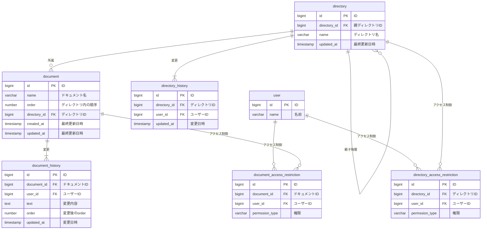

# 課題解釈

- ディレクトリ内のドキュメントの order 変更を管理する必要がある
- ユーザーごとに表示順が共通なら、ユーザーごとにディレクトリ構成を持つ必要はない
  - 拡張性として保持する必要があるかは要検討
- order を変更したときに、履歴を保持する必要がある？
  - その場合、影響を受ける他ドキュメントの順番も履歴に出力する必要があるため、結構大変

# 解答



# DDL

```sql
-- ユーザー テーブル
CREATE TABLE user (
    id BIGINT PRIMARY KEY,
    name VARCHAR(255) NOT NULL
);

-- ディレクトリ テーブル
CREATE TABLE directory (
    id BIGINT PRIMARY KEY,
    directory_id BIGINT,
    name VARCHAR(255) NOT NULL,
    updated_at TIMESTAMP DEFAULT CURRENT_TIMESTAMP,
    FOREIGN KEY (directory_id) REFERENCES directory(id) ON DELETE CASCADE
);

-- ドキュメント テーブル
CREATE TABLE document (
    id BIGINT PRIMARY KEY,
    name VARCHAR(255) NOT NULL,
    order INT NOT NULL,  -- ディレクトリ内の順序
    directory_id BIGINT,
    created_at TIMESTAMP DEFAULT CURRENT_TIMESTAMP,
    updated_at TIMESTAMP DEFAULT CURRENT_TIMESTAMP,
    FOREIGN KEY (directory_id) REFERENCES directory(id) ON DELETE CASCADE
);

-- ドキュメント履歴 テーブル
CREATE TABLE document_history (
    id BIGINT PRIMARY KEY,
    document_id BIGINT,
    user_id BIGINT,
    text TEXT,
    order INT,  -- 変更後の順序
    updated_at TIMESTAMP DEFAULT CURRENT_TIMESTAMP,
    FOREIGN KEY (document_id) REFERENCES document(id),
    FOREIGN KEY (user_id) REFERENCES user(id)
);

-- ディレクトリ履歴 テーブル
CREATE TABLE directory_history (
    id BIGINT PRIMARY KEY,
    directory_id BIGINT,
    user_id BIGINT,
    updated_at TIMESTAMP DEFAULT CURRENT_TIMESTAMP,
    FOREIGN KEY (directory_id) REFERENCES directory(id),
    FOREIGN KEY (user_id) REFERENCES user(id)
);

-- ドキュメントアクセス制限 テーブル
CREATE TABLE document_access_restriction (
    id BIGINT PRIMARY KEY,
    document_id BIGINT,
    user_id BIGINT,
    permission_type VARCHAR(50) NOT NULL,  -- 権限の種類
    FOREIGN KEY (document_id) REFERENCES document(id),
    FOREIGN KEY (user_id) REFERENCES user(id)
);

-- ディレクトリアクセス制限 テーブル
CREATE TABLE directory_access_restriction (
    id BIGINT PRIMARY KEY,
    directory_id BIGINT,
    user_id BIGINT,
    permission_type VARCHAR(50) NOT NULL,  -- 権限の種類
    FOREIGN KEY (directory_id) REFERENCES directory(id),
    FOREIGN KEY (user_id) REFERENCES user(id)
);

-- インデックス追加
CREATE INDEX idx_document_directory_id ON document(directory_id);
CREATE INDEX idx_directory_directory_id ON directory(directory_id);
```

# DML

```sql
-- ユーザーの追加
INSERT INTO user (id, name) VALUES
(1, 'Alice'),
(2, 'Bob');

-- ディレクトリの追加
INSERT INTO directory (id, directory_id, name) VALUES
(1, NULL, 'Root Directory'),
(2, 1, 'Sub Directory');

-- ドキュメントの追加
INSERT INTO document (id, name, order, directory_id) VALUES
(1, 'Document A', 1, 2),
(2, 'Document B', 2, 1);

-- ドキュメント履歴の追加
INSERT INTO document_history (id, document_id, user_id, text, order, updated_at) VALUES
(1, 1, 1, 'Created Document A', 1, '2025-04-20 10:00:00'),
(2, 1, 2, 'Updated Document A', 2, '2025-04-20 11:00:00');

-- ディレクトリ履歴の追加
INSERT INTO directory_history (id, directory_id, user_id, updated_at) VALUES
(1, 1, 1, '2025-04-20 10:00:00');

-- ドキュメントアクセス制限の追加
INSERT INTO document_access_restriction (id, document_id, user_id, permission_type) VALUES
(1, 1, 1, 'READ'),
(2, 1, 2, 'WRITE');

-- ディレクトリアクセス制限の追加
INSERT INTO directory_access_restriction (id, directory_id, user_id, permission_type) VALUES
(1, 1, 1, 'READ'),
(2, 1, 2, 'WRITE');
```

# ユースケースを想定したクエリ

## ユーザーがアクセスできるドキュメントのリストを取得

```sql
SELECT d.id, d.name
FROM document d
JOIN document_access_restriction dar ON d.id = dar.document_id
WHERE dar.user_id = 1 AND dar.permission_type = '10'; --10はreadを想定
```

## ドキュメントの変更履歴を取得

```sql
SELECT dh.updated_at, dh.text, u.name AS user_name
FROM document_history dh
JOIN user u ON dh.user_id = u.id
WHERE dh.document_id = 1
ORDER BY dh.updated_at DESC;
```

## ディレクトリの変更履歴を取得

```sql
SELECT dh.updated_at, u.name AS user_name
FROM directory_history dh
JOIN user u ON dh.user_id = u.id
WHERE dh.directory_id = 1
ORDER BY dh.updated_at DESC;
```

# アンチパターンを受けて

- ER 図の変更はなし
  - order 部分には、以下のページの「レコードに自身の順番を大きな整数で持たせる」で対応を行う予定
    https://zenn.dev/itte/articles/e97002637cd3a6#%E6%96%B9%E6%B3%954-%E3%83%AC%E3%82%B3%E3%83%BC%E3%83%89%E3%81%AB%E8%87%AA%E8%BA%AB%E3%81%AE%E9%A0%86%E7%95%AA%E3%82%92%E5%A4%A7%E3%81%8D%E3%81%AA%E6%95%B4%E6%95%B0%E3%81%A7%E6%8C%81%E3%81%9F%E3%81%9B%E3%82%8B
