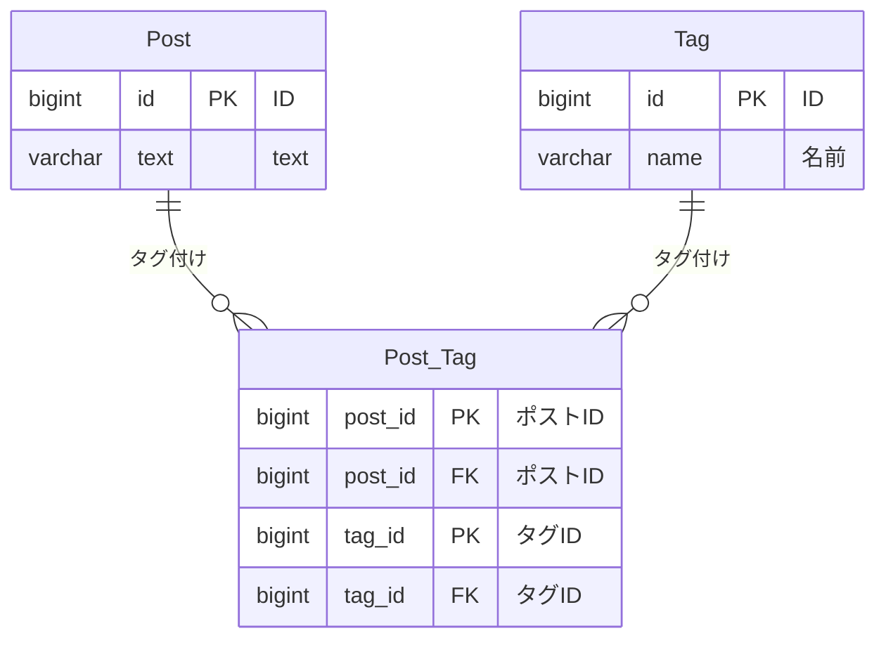

多対多の関係性なので中間テーブルを作成すればOK

```mermaid
erDiagram
Post ||--o{ Post_Tag: "タグ付け"
Tag ||--o{ Post_Tag: "タグ付け"

Post{
	bigint id PK "ID"
	varchar text "text"
}

Tag {
	bigint id PK "ID"
	varchar name "名前"
}

Post_Tag{
	bigint post_id PK "ポストID"
	bigint post_id FK "ポストID"
	bigint tag_id PK "タグID"
	bigint tag_id FK "タグID"
}
```