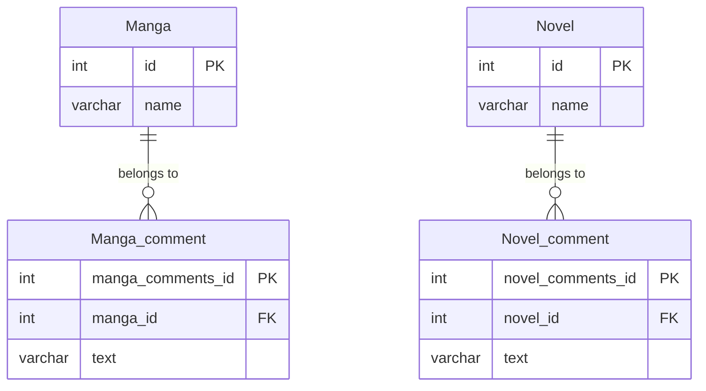

対策としては以下の4つが存在する

1. 連関エンティティの作成(参照の逆転)
    1. commentがmanga・novelを参照する形ではなく、manga・novelがcommentを参照する形に変える
        1. manga・novel側がコメントに対する外部キーを持つ形にする
        2. 1つのmanga・novelに対して複数のコメントを許容する場合、多対多のテーブルにする(そうでない場合、1対多とする
2. 親テーブルの作成(クラステーブル継承)
    1. manga・novelの抽象テーブル(仮にresourceテーブル)をつくり、そのテーブルに対してmanga・novel・commentが紐づく形にする
    2. この設計だと、manga・novel・commentが同列になるので、今回のケースではあまりよくない
3. テーブルの分割
    1. commentテーブルを分割し、manga_commentとnovel_commentというテーブルを作成する
    2. commentを全部網羅的に見たい処理がなければこれがシンプル
4. 参照するテーブルの数だけカラムを用意する
    1. manga_id、novel_idをそれぞれ用意する

今回は、一番シンプルなテーブルの分割で対応する

