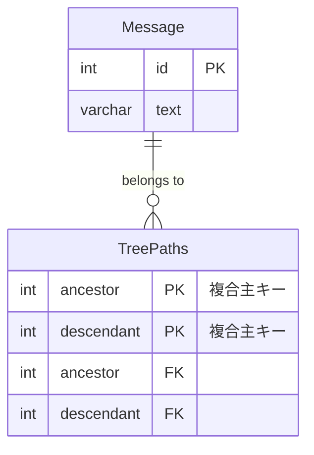

大きく対策は以下の4つ

1. 経路列挙モデル
    1. 親子関係をそれぞれのノードにパスとして持たせるモデル。
    2. ジェイウォークと同じデメリットが発生するため、今回は検討せず
2. 入れ子集合モデル
    1. 子孫の集合に関する情報を各ノードに格納する
    2. 深さ優先探索と同じ順でnsright、nsleftの値を再計算すればよい
    3. 個人的に、leftとrightの再計算がバグの温床になる気しかしなかったので候補から除外
        1. 個人的にはORMのサポートやライブラリのサポートが得られない場合、使用を考えない
3. 閉包テーブルモデル
    1. 別テーブルにてノード同士の関係性を定義するためのテーブルを追加して管理するモデル。
    2. 直近の親子関係のみではなく離れたノードの親子関係と自身を参照するパスも含める。
    3. 一番わかりやすいのでこちらを採用する。ちなみにメリデメは以下の通り
        - メリット
            - ツリーの取得が容易
            - データの追加、削除、更新が容易
            - 整合性を維持しやすい
        - デメリット
            - データ量がものすごく増える

今回はわかりやすい閉包テーブルモデルを採用する

