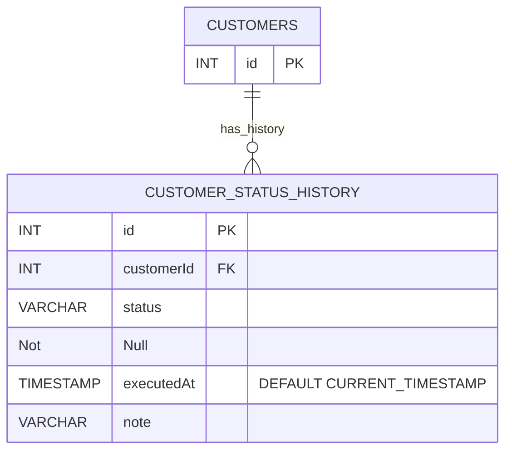

大きく対策は以下の3つ

1. booleanのフラグでなく、statusでカラムを持つ
    1. 今回のケースだと一人の顧客に複数の商談が発生する可能性があるため、不十分
2. staus管理 ＋ 履歴テーブルを持つ
    1. カスタマーテーブルを持ち、それに紐づく形で履歴管理を行う
        1. 状態は履歴テーブルに持ち、最新の履歴より状態を確認する
    2. immutable databaseの思想に近い印象
3. booleanのフラグをせめて日付管理にする
    1. 将来的にインデックスが聞くので、そこに対するアプローチにはなる

今回は2で実装を修正する

