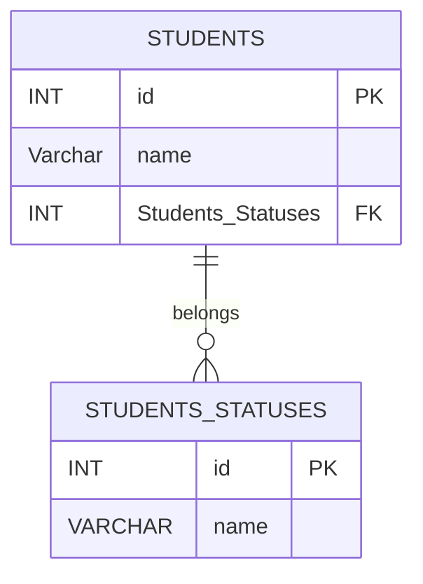

紹介されていた方法は一つ

参照テーブルを作成し、外部キー制約を宣言して参照させる。

```mermaid
erDiagram

  STUDENTS  ||--o{ STUDENTS_STATUSES : "belongs"

    STUDENTS {
      INT id PK
      Varchar name
      INT Students_Statuses FK
    }
    
    STUDENTS_STATUSES {
      INT id PK
      VARCHAR name
    }
```