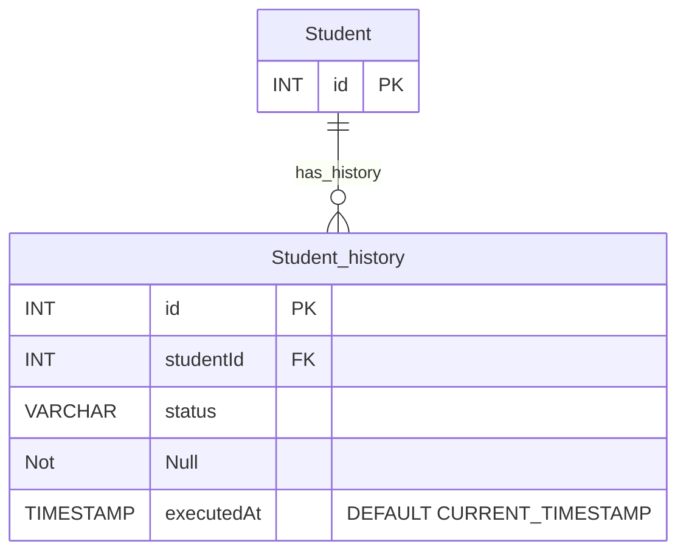

大きく対策は以下の3つ

1. booleanのフラグでなく、statusでカラムを持つ
2. staus管理 ＋ 履歴テーブルを持つ
    1. immutable databaseの思想に近い印象
3. booleanのフラグをせめて日付管理にする
    1. 将来的にインデックスが聞くので、そこに対するアプローチにはなる

今回は退会からの復帰等も想定し、履歴も行えるようなDB構成で対応する
そのため、上記2のケースで対策を行う

