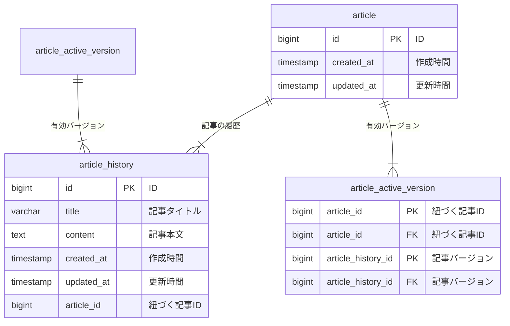

# 今回の要件

以下のように考え、履歴の保存形式を検討してみる

- 高速にできる処理
    - 最新の記事を一覧でみられる
    - 記事を更新すると履歴が保存される
- 高速にできなくてもよい処理
    - 特定の記事を指定して、履歴一覧を確認する
    - 過去の履歴に戻す

# 実装アイデア

- 有効世代バージョンタグ付けパターンでの実装が一番容易に見える
    - https://kumagoro-95.hatenablog.com/entry/2022/11/29/195352#google_vignette
    - 履歴を保存しなければいけないのがテキストデータなので、これで困らないと思われる

#  設計したテーブルのDDL
CREATE TABLE article (
    id BIGINT PRIMARY KEY GENERATED ALWAYS AS IDENTITY,
    created_at TIMESTAMP DEFAULT CURRENT_TIMESTAMP,
    updated_at TIMESTAMP DEFAULT CURRENT_TIMESTAMP ON UPDATE CURRENT_TIMESTAMP
);

CREATE TABLE article_history (
    id BIGINT PRIMARY KEY GENERATED ALWAYS AS IDENTITY,
    title VARCHAR(255) NOT NULL,
    content TEXT NOT NULL,
    created_at TIMESTAMP DEFAULT CURRENT_TIMESTAMP,
    updated_at TIMESTAMP DEFAULT CURRENT_TIMESTAMP ON UPDATE CURRENT_TIMESTAMP,
    article_id BIGINT NOT NULL,
    FOREIGN KEY (article_id) REFERENCES article(id) ON DELETE CASCADE
);

CREATE TABLE article_active_version (
    article_id BIGINT PRIMARY KEY,
    article_history_id BIGINT NOT NULL,
    FOREIGN KEY (article_id) REFERENCES article(id) ON DELETE CASCADE,
    FOREIGN KEY (article_history_id) REFERENCES article_history(id) ON DELETE CASCADE
);
## サンプルデータを投入するDML
DECLARE article1_id BIGINT;
DECLARE article2_id BIGINT;
DECLARE history1_id BIGINT;
DECLARE history2_id BIGINT;
DECLARE history3_id BIGINT;
BEGIN
    INSERT INTO article DEFAULT VALUES RETURNING id INTO article1_id;
    INSERT INTO article DEFAULT VALUES RETURNING id INTO article2_id;
    
    INSERT INTO article_history (title, content, article_id) VALUES
    ('初めての記事', 'これは最初の記事の内容です。', article1_id) RETURNING id INTO history1_id;
    
    INSERT INTO article_history (title, content, article_id) VALUES
    ('記事を更新しました', 'これは更新された記事の内容です。', article1_id) RETURNING id INTO history2_id;
    
    INSERT INTO article_history (title, content, article_id) VALUES
    ('別の記事', 'これは別の記事の内容です。', article2_id) RETURNING id INTO history3_id;
    
    INSERT INTO article_active_version (article_id, article_history_id) VALUES
    (article1_id, history2_id),
    (article2_id, history3_id);
## ユースケースを想定したクエリ

1. 記事の最新バージョンを取得
SELECT a.id AS article_id, ah.id AS history_id, ah.title, ah.content, ah.updated_at 
FROM article a
JOIN article_active_version av ON a.id = av.article_id
JOIN article_history ah ON av.article_history_id = ah.id;

2. 記事の履歴を取得（特定の記事のすべての履歴）
SELECT ah.id, ah.title, ah.content, ah.created_at, ah.updated_at 
FROM article_history ah
WHERE ah.article_id = 1
ORDER BY ah.updated_at DESC;

3. 記事を新バージョンに更新する
DECLARE new_history_id BIGINT;
BEGIN
    INSERT INTO article_history (title, content, article_id) VALUES ('記事を再更新', 'これはさらに更新された記事の内容です。', 1) RETURNING id INTO new_history_id;
    UPDATE article_active_version SET article_history_id = new_history_id WHERE article_id = 1;

# 課題検討
## 課題解釈
- 記事
    - 1000分程度の本文を記入して保存できる
        - テキストデータのみを保持すると想定
        - 持ち方は特に工夫しなくても(全世代のデータを保持しても)、そこまでカラムの容量が大きくならなさそう
            - ただ、履歴数の上限がないのが気がかり
            - 下手な持ち方をすると将来的に困る可能性あり
- 記事の履歴
    - 記事を更新すると履歴を保存できる
        - 記事の更新履歴のような値が必要かもしれない
        - なんなら、記事ごとにレコードを持ってしまってもいいかもしれない
            - テキストであればdiffは高速に取れるので、差分確認のユースケース等に対応することも用意
    - 特定の記事の履歴を一覧表示できる
        - 履歴を確認できるのか、その時点での本文を確認できるのか？
    - 履歴を選択して過去の記事の状態に戻すことが可能
        - バックアップの考え方のように、管理がいいのか、差分管理、増分管理がいいのか、少し悩ましい
            - https://www.networld.co.jp/solution/learn_first/backup/1st/01_basis/05_type/
- 記事の閲覧
    - 最新状態の記事を一覧表示できる
        - 最新状態の取得が高速にできることが必要
        - 将来的なページネーションの実装なども考える必要がある？
            - フィルターやソート等もあり得るので、対応できるようにする
                - 例:最新記事に特定の文字が存在する記事を持ってくるなど
- その他
    - gitのような、データベースの仕組みを使わないものはどのような仕組みで保存しているのかが気になる
        - gitは増分管理＋commitIDでの検索という印象

## 技術調査

- https://qiita.com/takanemu/items/d9c52811d70d37b232a9
    - 履歴を持ったテーブルを扱うとディスク容量増加やレコードが増えることによるパフォーマンス低下が発生
        - 履歴が必要不可欠なテーブルに限定する
    - 履歴には以下の二つの考え方がある
        - 履歴を参照するテーブルの過去情報が、変更されるタイプ
            - 商品名を変更したら過去のトランザクションテーブルの商品名も変更
        - 履歴を参照するテーブルの過去情報が、変更されないタイプ
            - 商品名を変更しても過去のトランザクションテーブルの商品名は、取引した時の商品名のまま
- https://qiita.com/k-yokota/items/f4e671cd3b3aa350700f
    - 履歴管理には大きく以下の二種類がある
        - ログ
            - 記録を残すテーブル
        - バージョン(リビジョン)
            - データが変更されるたびに新しいバージョンまたはリビジョン番号を振って新しいレコードに書き込むタイプ
                - wordpressはこのタイプの模様
                    
                    
                    
- https://scrapbox.io/kawasima/%E3%82%A4%E3%83%9F%E3%83%A5%E3%83%BC%E3%82%BF%E3%83%96%E3%83%AB%E3%83%87%E3%83%BC%E3%82%BF%E3%83%A2%E3%83%87%E3%83%AB
    - イミュータブルテータモデルで設計することが履歴としての役割を持つことがある
        - 上で書いたwordpressの例がかなり近い
            - [wordpressはこのタイプの模様](https://www.notion.so/wordpress-1a95b8021fbd80978101f3dc378a13ad?pvs=21)
- https://chatgpt.com/share/67c2c48d-9d14-8012-bdac-8b164e65a1a3
    - 結果を見ると、記事と履歴のテーブルを分けている印象
        - これなら、記事と履歴を同じテーブルにして、記事テーブルに持ったほうがいい気がする
            - ただ検索のときに性能差が出そう
    - 割と自分の中の正解のイメージに近い